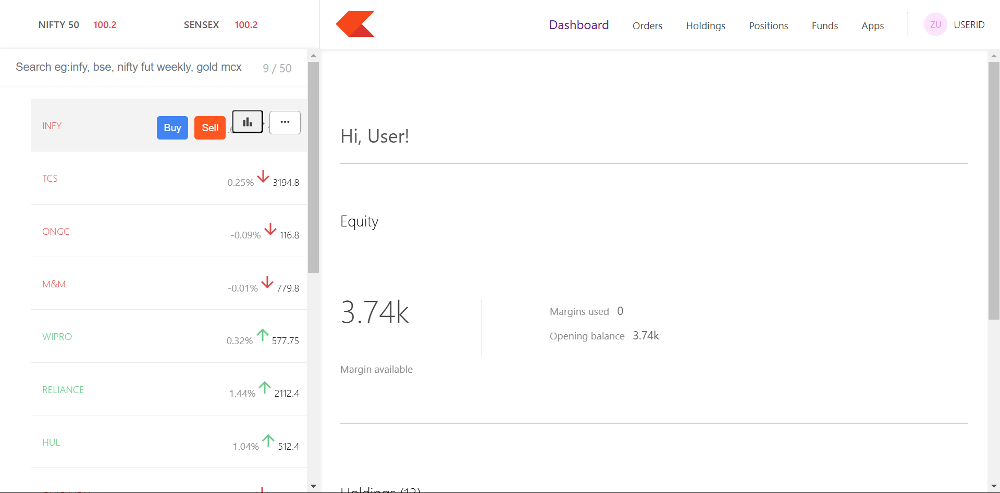
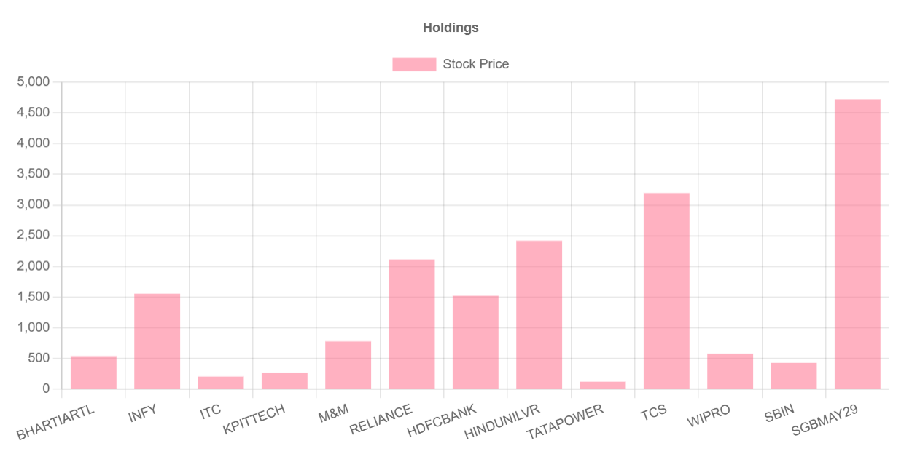
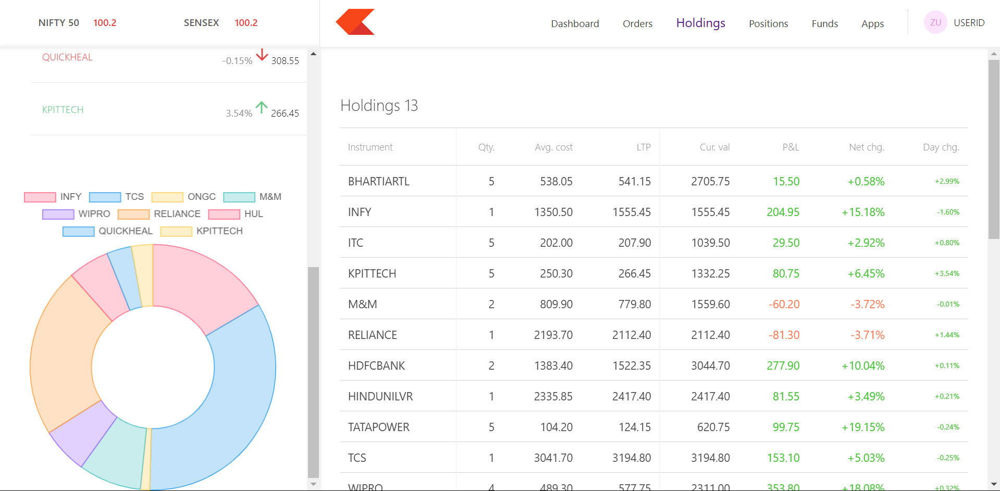
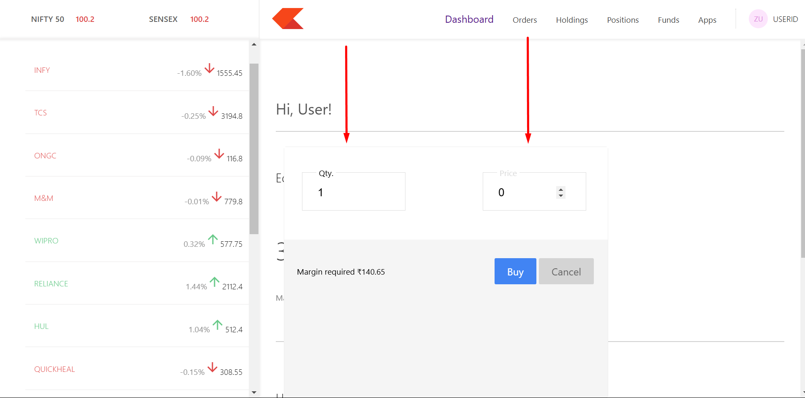

# Zerodha Clone (Dashboard)

It's another part of Zerodha clone. After logging in, user can show the current stocks in the left side and can buy any stock, that is the watchlist. On the right part users can see their own stocks situation. This datas are coming from database. This datas can be dynamic by adding live data providing APIS. User can also see their stocks conditions by chart. Doughnut and bar chart has been used here. 


## Technologies

- React.js
- MongoDB
- Express.js
- Node.js

## Installation

1. To use this project in you local machine, you should set up the frontend and backend part also. Under a folder, create 3 seperate folders as dashboard, backend and frontend. And then start them individually.

> ⚠️ **Note:** Start frontend server first, to avoid conflict with port numbers.

2. Clone the dashborad repo into your local machine under dashboard folder (as described in step 1).

3. Navigate to the dashborad folder & install all the dependencies.
   ```git bash
   cd basdboard_directory_name
   npm install
   
4. Now, you can start the server.
   ```git bash
   npm start


 ## Screenshots

 ### Dashborad Home
   

 ### Holdings Chart
 

 ### Holdings Data
 

### Buy Window

