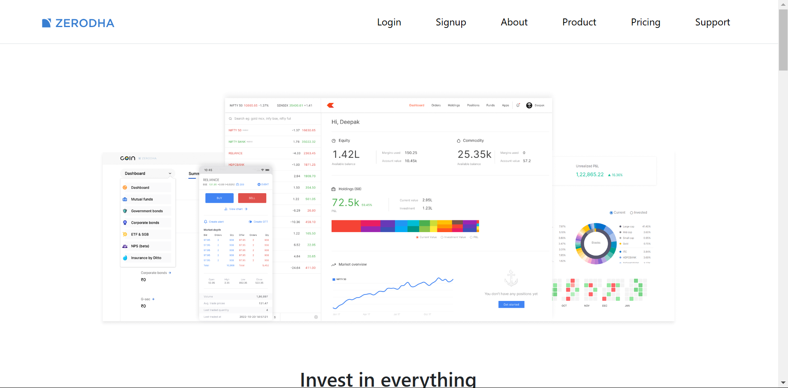
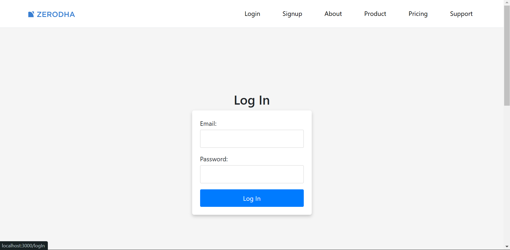
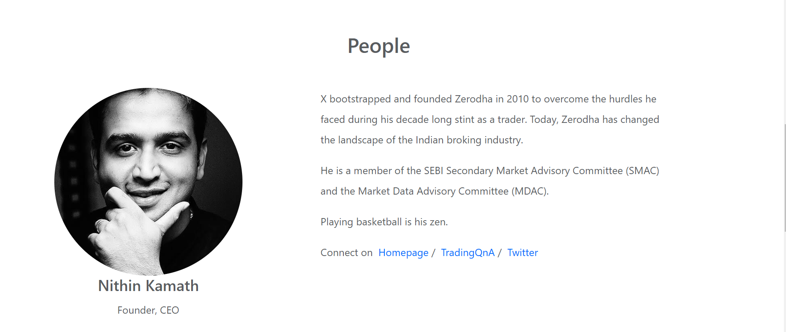
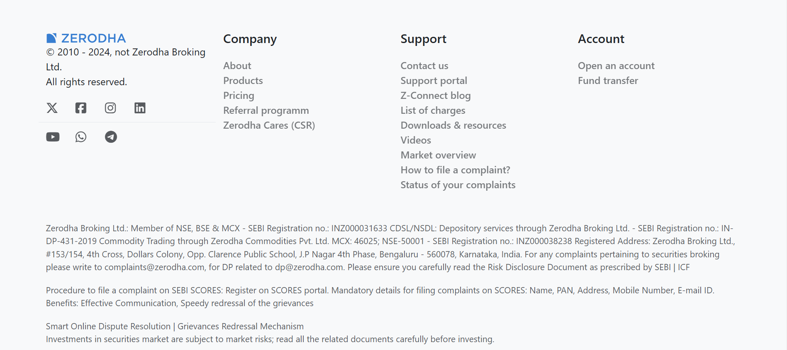

# Zerodha Clone Frontend
As a practice work, I tried to build a clone of stock exhange platform. I used React for the frontend and react-router-dom for navigating. This project has another two parts dashboard and backend. In dashboard users can watch their stocks informations.

## Installation
1. Clone this repository.
   ```bash
   git clone https://github.com/MdMahdiHasanTazelly/Zerodha_clone_frontend

2. Navigate to project folder & install associated deepndencies
   ```bash
   cd folder_name
   npm install

3. Set up the <a href="https://github.com/MdMahdiHasanTazelly/Zerodha_clone_dashboard">dashboard</a> and <a href="https://github.com/MdMahdiHasanTazelly/Zerodha_clone_backend">backend</a>. 

4. Start the server.
   ```bash
    npm start

<br/>

> ⚠️**Note:** 
>- Start the frontend first, so that it can be run on port 3000 and then dashboard will automatically be on   port 3002.
>- All the 3 folders (frontend, backend & dashboard) should be in a single folder.


## Screenshots

### Home page


### Login


> **NB:** Both login and signup page are same.

### About


### Footer

